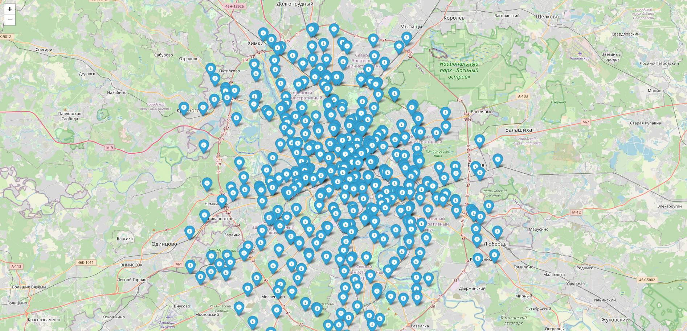

Railway Network Explorer
Это веб-приложение для загрузки, анализа и визуализации данных о железнодорожной сети из OpenStreetMap.



Ключевые возможности
Загрузка данных: Автоматически скачивает станции и пути из OpenStreetMap (OSM) для заданной области.
Обработка и анализ: Определяет связи между станциями, находит узловые пункты и генерирует тестовые данные.
Хранение в БД: Сохраняет все данные в локальную базу данных SQLite с помощью SQLAlchemy.
Интерактивная карта: Визуализирует сеть на карте с помощью Folium, выделяя узловые станции.
Модульная архитектура: Код разделен на логические компоненты (загрузка данных, веб-интерфейс, модели БД).
Стек технологий
Бэкенд: Python, Flask
База данных: SQLite
ORM: SQLAlchemy
Гео-данные: Overpass API (для OpenStreetMap)
Визуализация: Folium
Как это работает
Приложение имеет два режима работы, которые управляются через main.py:

Режим импорта (import):

Скрипт подключается к OSM и загружает данные с помощью модулей data_loader и data_processor.
Полученные данные (станции, связи, развязки) сохраняются в базу данных SQLite (instance/railway.db) в соответствии со структурами, описанными в models.py.
Режим веб-сервера (runserver):

Запускается Flask-приложение (app.py).
Оно читает данные из уже созданной базы данных.
Генерирует интерактивную карту с помощью Folium и отображает ее на главной странице.
Как запустить
1. Установка
Сначала клонируйте репозиторий и установите все необходимые зависимости из файла requirements.txt:
```
Bash
git clone https://github.com/ваш-логин/ваш-репозиторий.git
cd ваш-репозиторий
pip install -r requirements.txt
```

2. Загрузка данных
Перед первым запуском веб-сервера необходимо загрузить данные и создать базу. Выполните в терминале:

```
Bash
python main.py import
```
Эта команда запустит процесс загрузки данных для небольшой области в Москве (можно изменить в main.py). После выполнения у вас появится файл instance/railway.db.

3. Запуск веб-приложения
Теперь, когда база данных готова, запустите веб-сервер:

```
Bash
python main.py runserver
```
Откройте браузер и перейдите по адресу http://127.0.0.1:5000. Вы должны увидеть интерактивную карту с железнодорожной сетью.

Структура проекта
Код организован по принципу разделения ответственности:

main.py: Главный файл для запуска команд (import, runserver).
app.py: Код веб-приложения Flask.
database.py: Настройка подключения к базе данных.
models.py: Описание таблиц базы данных через SQLAlchemy.
import_data.py: Логика импорта данных из OSM в БД.
data_loader.py & data_processor.py: Модули для получения и обработки данных из OSM.
templates/: Папка с HTML-шаблонами.